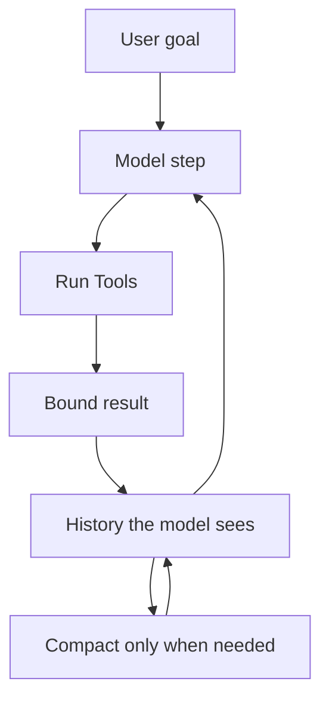
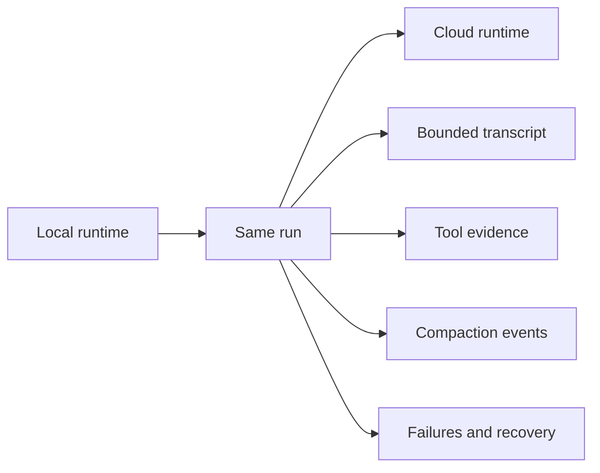

# Building a harness for open models

A model that "forgot" the task may have been shown mostly stdout. A model that "cannot use tools" may have been given a transcript where compaction rewrote the goal into something vague. And a model that seems "slow" may be running in a harness that adds the current time to the system prompt on every turn, breaking cache reuse.

I know that last one a little too well.

Most popular agent harnesses were built around closed frontier models. Closed models have huge context windows, a lot of recovery ability, and a pretty generous token budget, so a lot of harness bugs never surface. You can be sloppy with the environment and the model bails you out.

At the same time, open-weight models have gotten much better at coding and agentic work. GLM-5.2 feels like a recent example of that shift becoming harder to ignore. It is obviously not a model you'll run on your mac, but it is an openly available model built for long-horizon work and also our most popular model on Ollama right now. [GLM-5.2 on Ollama](https://ollama.com/library/glm-5.2).

I don't think the point is that every capable open model needs to run locally. The more interesting thing is that more people will put both large and small open models into the same harnesses they already use.

Sometimes that works. Sometimes the model completely loses the plot, fails tool calls, or cannot continue after compaction (if even compact at all). It is tempting to call that a model problem.

However, a lot of the time the harness is making the task much harder than it needs to be for the model. This issue is exacerbated in harnesses that were tuned around a frontier model. I've personally seen this with Claude Code and open models (especially local ones).

I have been building agent loops around open models for a while now, and each model seems to have its own way of exploring, using tools, and getting unstuck. I call it the model's essence. I see this as the model's working style. It can usually be observed in the traces of a harness. You get to see what the model is fighting and what it enjoys doing.

My general take is to start simple and get out of the way. Then watch where the model struggles and improve the environment around it. I just released the new Ollama harness which is meant to be a simple way to experiment with models and get some quick work done while you're at it. I'll share my learnings from building this (and many others before).

This post is not a recipe for one canonical harness (although I wish such a thing existed). It is a few things that have been easy to get wrong: tool design, context, compaction, synthetic tool calls, the prefix cache, and the loop itself. A lot of it is informed over the last year of building harnesses as well as a lot of the lessons I had building the new Ollama harness (which you can run by typing `ollama`).

## The harness is the environment

At its core, an agent is still a small loop:

1. Take a goal.
2. Ask the model what to do.
3. Run the tools it asks for.
4. Present the results to the model.
5. Repeat until the model stops.

The part that gets annoying quickly is that every step changes what the model sees next. Tool schemas, tool output, message order, compaction, approval state, cache shape, and runtime context are all part of the environment you built for it.



Most harness bugs look like model-quality issues until you dissect the environment it's running in.

In the harness I built, that loop is an explicit state machine with four phases. The whole thing is a switch:

```go
for {
    switch st.phase {
    case runPhaseModel:
        s.runModelStep(ctx, &st)
    case runPhaseTools:
        s.runToolStep(ctx, &st)
    case runPhaseCompact:
        s.runCompactionStep(ctx, &st)
    case runPhaseDone:
        return s.finishRun(ctx, &st)
    }
}
```

`runModelStep` sends the request and collects the response. `runToolStep` executes whatever tool calls came back, with approval checks and output bounding. `runCompactionStep` is a check, not an action: it decides whether history needs shrinking (either because the context is near its limit or because a tool result overflowed) and only rewrites history when it does. Most of the time it is a no-op. `runPhaseDone` is the terminal state.

The transitions are where all the interesting behavior lives. A tool result that is too large for the remaining context forces compaction *before* the next model step, not after. A run that hits the tool-round guard stops cleanly instead of looping forever. A model that returns a server error gets a corrective message appended and retries, up to a limit. The state machine is small. The complexity is all at the edges.

The exact state machine does not need to be this one. Keeping the core loop small is the key takeaway. The complexity belongs at the transitions: constructing a request, deciding what may enter history, running preflight checks, handling failures, and making recovery visible.

## Tools are part of the model's working language

I tend to start with fewer tools than I think I need.

The first iteration of the harness had just `Bash`. I tested both local and cloud models to push them to their limits. Queries like "who is parth sareen", "edit this file", "review the changes on this branch," and "when did drake release the motto?". I then added `read`, `edit`, and some web search tools.

There are some efficiencies to find through the tools for sure, or pushing the tool definition a bit more for certain models, but this requires art, vibes, and a nice, vibed benchmark. From my goal of just getting the user started with open models, I leave the exercise and proof to the reader.

Every tool definition is more tokens. But it is also about observing what a model reaches for. Some models will prefer structured edits. Some will use shell commands even when a bespoke tool exists. Some get stuck when the tool surface is too large. The model's voice is hidden in its actions and traces. Observe them and you too will develop the right intuition to write great tool definitions.

Bash is useful as an escape valve here. If the structured tools are too restrictive, a model can still inspect a repository or make progress. You see this in frontier agents too: when a file tool fails or feels awkward, they often fall back to `cat`, `sed`, or a narrower shell command.

Start with a small surface, watch the traces, and let the repeated model friction and frustration suggest the next correct primitive. If a model repeatedly makes awkward batched edits, it may want a multi-edit tool. If it spends calls locating code, it may want better search or ranged reads.

Evals are how I dream of verifying these changes. Watching a model work is often how I find the question worth evaluating in the first place. There are some basic evals I did for the Ollama harness, but more than evals using and feeling out a harness is much, much more important.


## Synthetic Tool Calls

One thing I kept running into was that the shape of history matters as much as the content.

I first loaded a manually selected skill by inserting its instructions as a user message, which is very common for most harnesses. However, I found that local models would sometimes change tone or treat the skill as a new request.
The better shape was to represent it as the same interaction the model would have produced itself:

```text
user request
assistant synthetic_tool_call: load_skill
tool result: skill contents
model response
```


I call this synthetic tool calls.

Nothing actually invoked the tool in that moment. But the model already understood what that transcript shape meant: something happened, and here is the result to work from. That felt much more natural than trying to sneak the same information into a user message or system prompt (cache breakage!).

That ended up being useful outside skills too. Compaction can be represented as a synthetic tool call and result rather than an invisible prompt mutation. On resume, a tool call left dangling by a crash can receive a synthetic result instead of making the next request structurally invalid:

```text
Tool execution interrupted before a result was recorded.
```

I do not think of this as faking activity. I see it closer to speaking the model's language through tool calls (which has a high emphasis from training for agentic use cases).

> An informal 4k-context check, not a benchmark: adding `user: compact history` before the synthetic pair cost seven tokens and did nothing for Gemma 4. Llama 3.2 started emitting JSON and inventing statistics. The synthetic tool call/result pair alone was enough.

The extra user message turned something meant to fade into the background into something the model treated like a fresh instruction.


## Tool output is the next prompt

This is the easiest thing to forget: tool output is not a terminal log after the call finishes. It is the next model input. I have had to remind myself of this more than once. It takes a lot of effort and design, and is just as important as the tool input itself.

While trying coding tasks with Gemma 4 at 4k, one large tool result could consume enough context to force compaction immediately. The summary was then asked to recover exact code state, partial exploration, and the original task all at once.

A simple approach is to bound the tool result before it enters history.

A shell command can print thousands of lines. A web page can contain ten useful paragraphs and a city of markup. A file read can pull a whole file when the model needed twenty lines. Selectivity of information is needed here as we should only present the most important bits to the model (especially local ones).

The caps will depend on the product and runtime, but the pattern repeats:

- Cap Bash output.
- Clean and bound web fetches.
- Prefer line ranges and search over whole-file reads.
- Give smaller contexts smaller result budgets.
- Say when a result was truncated.

The caps should not be one-size-fits-all. A 128k-context model can absorb a large tool result without pressure. A 4k-context model cannot afford the same luxury. In the harness I built, tool output is bounded by the context window in tiers:

| Context window | Max tool result (runes) |
|---|---|
| > 8k tokens | 60,000 |
| ≤ 8k tokens | 6,000 |
| ≤ 4k tokens | 3,200 |


That is just the first gate. Before a tool result is appended to history, the harness also projects the post-append token count against the compaction threshold. If the result would push the next request past the threshold, the cap shrinks dynamically to whatever fits, minus a small reserve for the truncation marker itself. The model never sees a tool result that would immediately force compaction unless there was genuinely no other option.

The effect is that small-context models get small tool results by default, and even the default cap tightens when the conversation is getting long. The model does not have to know about any of this. It just sees output that fits.

Silent truncation is particularly bad. It teaches the model that the visible output is the whole output.

A useful result tells it what happened and what to do next:

```text
[tool output truncated: showing the first 80 lines and last 40 lines.
Use a narrower command, line range, or search query if more detail is needed.]
```

I found this to be especially helpful for local models (and even GLM-5.2 with vs. without) where the models had a hard time re-grepping or re-reading the file after doing a bare read which was defaulting to the first 100 or so lines.

In an ideal world you'd have an artifact-based output: keep the full result outside the prompt, show the model a preview, and give it handles for range reads or search later. You do not need that system on day one. You do need to resist dumping everything into the model's prompt and hoping it will save you.

There is a worse case than truncation: a tool result so large that even the tiered cap produces something the context cannot hold. When that happens, the result is fully omitted with a marker:

```text
[tool output truncated: output omitted because the context is full;
omitted ~2400 tokens. Use a narrower command, line range, or search query
if more detail is needed.]
```

At that point the result is useless to the model. Rather than pass it along and hope, the harness treats it as a compaction trigger:

1. **Force compaction** with zero kept user turns. Summarize everything, keep no recent context.
2. **Re-insert** the assistant's tool-call message after the summary, so the transcript stays structurally valid.
3. **Refit** the overflowing tool result against the *full* context window (not the threshold), recalculating how much room actually exists after compaction.

The result the model finally sees may still be truncated, but it is truncated to fit the real available space, not a cap that was set before compaction ran. This is the kind of recovery that is invisible when it works and catastrophic when it is missing. A model that gets an empty-omission marker and no compaction will often stall or hallucinate the missing content. A model that gets a refit result can usually continue.

> I hand wrote a [mock browser tool](https://github.com/ollama/ollama/blob/4f7786d0baa9085e568c5d48135b5347daaddd8f/app/tools/browser.go) for gpt-oss last year. Instead of dumping a full page into context, it saves results out of prompt and lets the model page through them.


## Compaction is a safety valve

Compaction is a useful tool, but it is neither a replacement for more context or a memory structure.

It is a lossy transformation performed under pressure.

In the loop, I represent compaction like so:

```text
system prompt
assistant synthetic_tool_call: summary
tool result: Conversation summary: ...
kept recent messages
```

The ordering matters. The summary stands in for older context, while the latest concrete turns remain closest to the next model response. The synthetic tool result also includes a continuation instruction, "continue the task in progress, the history has been compacted, do not mention compaction to the user", so the model knows what to do next without a separate user message telling it.

I'm not going to pretend to be an expert in compaction. I think the above is relatively generally accepted as a decent compaction strategy. I will say that I think things like compaction and harness-related tooling might become model behavior. You can imagine that the model can update its own prompt and then do the next round of turn even through tool calls. Or having bespoke, trained summarizers.

> Rajan wrote a great piece on [LLM compression](https://www.rajan.sh/llm-compression).

The failure cases matter more than the happy path. And honestly, that's a common theme in harness engineering, but even more honestly, literally all software ever written.
I battled many things like: if the summary is empty, do not pretend memory was preserved. If compaction does not shrink the request, stop clearly. If the context is tiny, "summary plus the last N turns" can still be too much. Repeated compaction that does not create room is not necessarily a model quirk, the harness could be doing something wrong.

The Gemma and Qwen evals (I tested Qwen alongside Gemma for these runs) made this ordinary rather than theoretical. Some runs did useful work after one web search. Some code tasks read one file in a multi-file problem and then responded as if the task itself was under-specified. Some compaction attempts came back empty.

The question I kept asking myself was: what did we ask the model to recover from?

If the answer is unbounded output, vague summaries, hidden truncation, and a context window we guessed wrong, blaming the model is too easy.

## Keep the prefix stable

LLM inference caches the beginning of the prompt. If the first N tokens of a request are byte-identical to the previous one, those tokens are served from cache instead of re-computed. On a local model, this is the difference between a response that starts instantly and one that takes seconds. On a cloud model, it is the difference between cheap and expensive.

Everything I have described so far interacts with the prefix cache:

- **System prompt** is the very front of the prefix. Put the current time, a random session ID, or per-request state there, and you bust the cache on every request. I did exactly that while building OllamaClaw (my personal assistant agent): fresh timestamps went into the system prompt on every turn, so the stable prefix was not stable at all.

> This was the culprit: [one commit](https://github.com/ParthSareen/OllamaClaw/commit/2bb2038a5d58f19c599aacbfe8c9f44fa2a8717f) added fresh Pacific and UTC timestamps to every system prompt.

- **Tool definitions** are part of the prefix on many inference backends. Reordering tools, adding one mid-conversation, or changing a description busts the cache even if the model never uses that tool. In the Ollama harness, tools are sorted alphabetically by name before every request so the order is deterministic. That said, not every inference engine renders tool definitions into the prompt the same way and YMMV with not thinking about this.


- **Message history** extends the prefix. Each new turn appends to the end, so the cache grows naturally. But compaction rewrites the middle of history. The summary replaces the archived messages, which means the first request after compaction pays full price for the entire prompt. That is a cost of compaction, not just an information loss. That's also okay. Part of harness design is knowing when to take that cache hit to keep a task going correctly.


The general principle: put stable things first, volatile things last. If something changes every request, it belongs at the end of the message history, not in the system prompt. If something changes every few turns, it should be in the suffix that compaction could preserve, not in the prefix it replaces.


## Instrument before you optimize

The cache bug above took me too long to find because I was looking at the model, not the request. Once I instrumented the actual requests across runs (what changed between turns, what stayed stable, how much context was spent on tools versus history, and what the runtime actually loaded), the answer was obvious.

I want to be able to inspect the request shape across turns at any point. Ollama is unique because I was able to instrument the entire process from harness to inference, up and down the stack. I hope to make some of this more accessible to make building your own harnesses easier.


## Local to cloud should change the runtime, not the run

Local-first should not mean local-only.

Some tasks need a stronger model, more context, or faster inference. That should not be treated as failure. The handoff should be boring: change the runtime without making the user start the task over.



What should travel is a bounded transcript, the relevant tool evidence, compaction events, and the failures that happened along the way. What should not travel is hidden prompt mutation or giant terminal logs that the next model would have to rediscover.

With this design, the cloud model inherits a cleaner run than it would have had if I had only designed for cloud in the first place. Local constraints force you to decide what evidence is worth carrying forward. Moving to cloud then changes the runtime, not the reality of the task.


## Leave room for the builder

I do not want this to read like a recipe where every harness needs to have the same parts. I think a lot of the good ones will look quite different.

Some harnesses should be tiny. Some should have no tool execution. Some should be deep and feature rich. Some should be headless and boring. I truly think there is so much to build and tailor for yourself. And with LLMs, you can have infinite customization at any point.

Some guiding questions for your next harness design:

- What did the model actually see?
- Which tool schemas are in the request, and why?
- What output is allowed into history?
- What happens when tool output is truncated?
- What happens during and after compaction?
- Does the UI render loop state, or maintain a parallel truth?
- If the run moves from local to cloud, what state and evidence survive?


The point is not to wrap open models in a framework so large that the model disappears. A loop that spends context deliberately, shows failure clearly, and gives the model a world it can be itself in is the most important.

If you're building a harness and want to ever talk shop, [dm me on x](https://x.com/parthsareen)!
