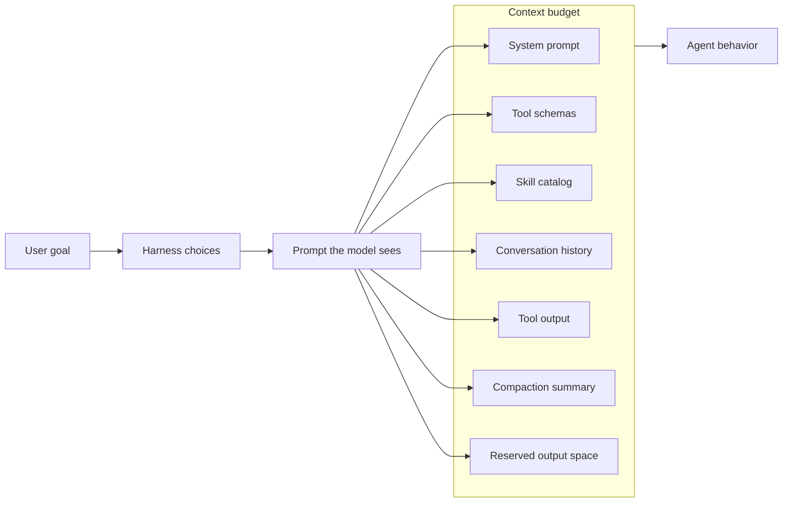
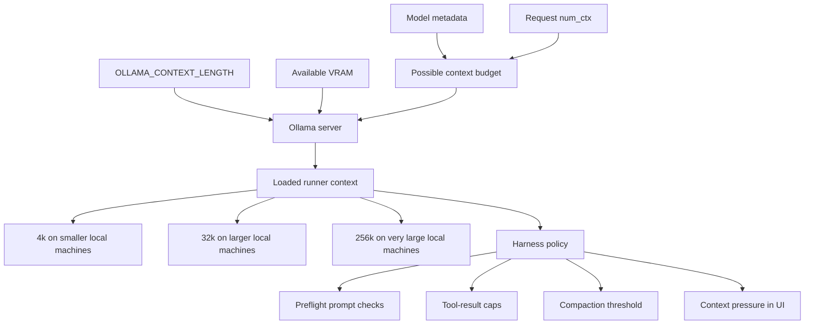
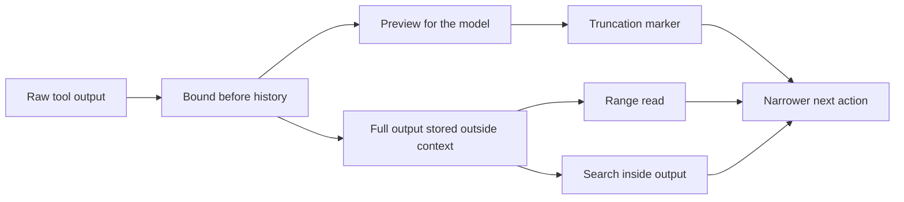
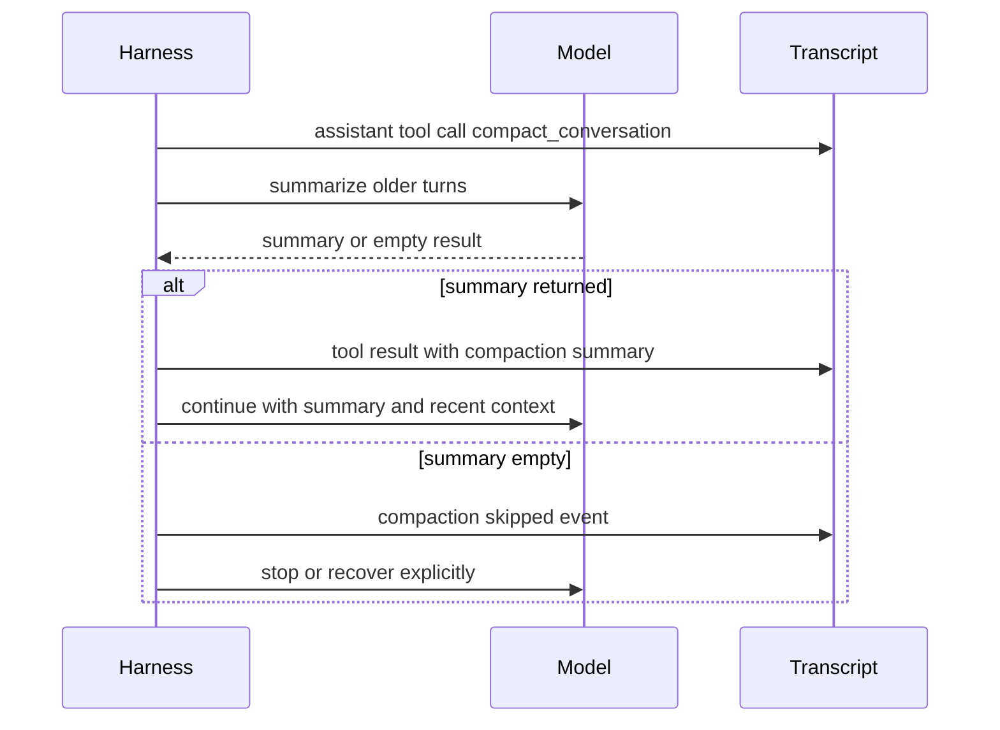

# Creating the Ollama Agent Harness

Local models make agent design more honest.

When an agent loop is built around a frontier model, the harness can get away with a surprising amount. It can return too much tool output. It can carry a giant prompt. It can compact late and hope the model writes a good enough summary. It can blur together model quality and harness quality because the model often recovers from a bad environment.

Local models do not give you as much room to hide.

> **Note:** This is probably familiar if you have tried running local models through a harness designed around Claude Code, Codex, or another frontier-agent workflow. The model can look worse than it is because the surrounding loop assumes a stronger model, a larger context window, and more tolerance for noisy transcripts. Pi has felt better to me in some of these experiments partly because it is minimal. There is less harness in the way: fewer assumptions, less ceremony, and fewer hidden tokens competing with the task.

That has been the most useful part of working on the Ollama agent harness. The failures are less mysterious once you look at the trace. A model that "forgot" the task might have been shown mostly stdout. A model that "cannot code" might have spent its first turn inside a prompt that was already too large for the runner that actually loaded. A model that "cannot use tools" might have been handed a transcript where compaction rewrote the task into something vague, or where a skill catalog took a chunk of the context before the user had asked for anything.

Most harness bugs look like model-quality bugs until you inspect what the model actually saw.

That is the thesis I keep coming back to: for agents, context is not an implementation detail. It is the product surface. Tool schemas, tool output, message order, compaction, cache locality, approval results, runtime options, and failure messages are all part of the interface the model uses. The harness is the thing that decides what the model can perceive.



## The Throughline

This connects to a pattern I keep noticing in my work: the useful feeling rarely comes from the model alone. It comes from removing the distance between a model and the thing someone actually wanted to do.

Ollama Launch was one version of that. The point was not to make setup more impressive. It was to make the first useful moment arrive faster: no scavenger hunt through environment variables, no pile of incidental configuration before the model can help, no feeling that the user has to become an infrastructure engineer just to try an idea. When it works, the feeling is simple: "Oh, it actually works."

The agent harness is a stricter version of the same idea. Simplicity is not the absence of machinery. It is machinery that has spent enough time deciding what can disappear, what must stay visible, and what needs to become understandable the moment it breaks.

For agents, that last part matters more. A chat UI can hide a lot. A local agent loop cannot. If a tool result eats the context, or compaction erases the goal, or the runtime allocated 4k when the harness budgeted for 128k, the abstraction has to become legible. The best harness should feel invisible when the loop is healthy and very explicit when it is not.

## The Harness Is What Holds The Agent

An agent loop looks simple from far away:

1. Take a goal.
2. Ask the model what to do.
3. Run the tools it asks for.
4. Present the results to the model.
5. Repeat until the model stops.

That is the easy diagram. The hard part is everything that happens around it.

The harness decides which tools exist, how their schemas are rendered, what the model sees from each call, how much old conversation stays in history, when to compact, what compaction means, how approvals are represented, where errors go, and how the runtime's actual context window is discovered. A lot of "agent intelligence" is really the result of those choices.

This matters more for local models because they are less forgiving. They may have smaller effective context windows, less reliable tool planning, slower prompt evaluation, weaker summarization, and more sensitivity to noisy transcripts. That does not make them useless for agents. It means the harness has to stop wasting the context they have.

The goal is not to build a clever wrapper that pretends every local model is a frontier model. The goal is to build a loop that behaves well at 4k and 32k, not only in the fantasy case where the model has a huge context and uses all of it perfectly.

## What The Evals Taught Me

I started treating the eval logs less like pass/fail scores and more like a set of small design interviews with the harness.

In the early Gemma and Qwen runs, the failures were not dramatic. They were ordinary, which made them more useful. Some tasks succeeded with one web search. Some code tasks wandered. One Gemma run made repeated tool calls and compactions, then effectively asked to be reminded of the goal. Several Qwen runs hit compaction attempts where the summary came back empty. Another run read only one file for a multi-file task, then responded as if it had not understood what it was supposed to do.

Those are easy to write off as "the model is weak." Sometimes that is true. But the harness has to answer a better question first:

What did we ask the model to recover from?

If the model returns an empty compaction summary, the harness should not pretend memory was preserved. If a tool result would consume most of a 4k prompt, the harness should not dutifully store the whole thing and hope summarization saves it later. If a first request is already too large, the harness should fail before it stores bad state. If a tool loop is making no progress, the harness should stop clearly instead of letting the transcript become a pile of repeated actions.

This is a different posture from "make compaction smarter." Compaction helps, but it cannot be the main bet. Local-agent reliability starts before compaction, with what the harness allows into context in the first place.

That led to one of the first concrete design choices: preflight the prompt before storing a new user message. If the first request is already too large, the harness should fail while the conversation is still clean. It should not append an impossible turn, try a request that cannot fit, and leave the user with a broken transcript. At 128k, you can often recover later. At 4k, bad state arrives fast.

## Runtime Context Beats Theoretical Context

One of the more subtle bugs in agent harnesses is budgeting against the wrong context window.

Model metadata might say a model supports a large context. The request may set `num_ctx`. The environment may set `OLLAMA_CONTEXT_LENGTH`. The server may auto-load the model with a smaller effective context based on memory. Those are not the same thing.

Ollama's current context behavior makes this concrete. `OLLAMA_CONTEXT_LENGTH` defaults to `0`, which means automatic behavior. The default effective context is based on available VRAM: 4k below 24 GiB, 32k from 24 to 48 GiB, and 256k at 48 GiB or above. A model may have a much larger training context than the runner actually allocates.

That difference is not academic. If the harness thinks it has 128k tokens but the local runner is actually at 4k, every downstream choice is wrong: when to compact, how much tool output to keep, whether to show context pressure, whether a prompt is safe to send.

That shaped where the budgeting logic had to live. It could not be a static model-card guess computed once at startup. The harness needed to load the model, observe the effective context the server actually chose, and then make its later choices against that number. Otherwise a lot of careful-sounding context policy is just arithmetic against the wrong denominator.



The agent harness should get as close as possible to the runtime truth. In Ollama, that means resolving effective context after the local model is loaded and using server state like `/api/ps` where possible. It also means tracking prompt estimates and server-reported prompt eval counts as the run progresses.

The advantage of building this close to Ollama is that the runtime is nearby. The harness can evolve from rough character-based estimates toward exact rendered-prompt accounting, tokenizer-aware budgeting, effective context windows, context shift behavior, cache metrics, and model metadata. A generic harness has to guess more. An Ollama-native one can eventually ask the system that is actually running the model.

## Tool Output Is Product Design For Models

The most direct way to waste context is to return raw tool output as if the transcript were a log file.

A shell command can produce thousands of lines. A web page can be longer than the useful part by two orders of magnitude. A file read can accidentally pull in the entire file when the model needed twenty lines. For a human, this is annoying. For a model, it changes the next prompt. The result is not "more information." It is often less usable context.

So the harness has to shape tool output before it becomes history.

A useful reframe was to stop treating tool output as something to display in a terminal and start treating it as model input. A result is not inert after the tool finishes. It is the next thing the model has to reason over. That pushed the design toward bounded results, visible truncation markers, line-range file reads, smaller caps for smaller contexts, and a second layer of session-level truncation before appending results to history.

In the current agent loop, this shows up in several small rules:

- Bash output is capped and marks the approximate omitted tokens.
- Web fetch content is bounded before returning to the model.
- File reads support line ranges, `start_line`, `end_line`, and `line_count`.
- Session-level tool results are truncated again before they are appended to history.
- Small context windows get smaller tool-result caps.
- When a tool result would push the next prompt beyond the compaction threshold, the harness shrinks it before continuing.

The marker matters. Silent truncation teaches the model the wrong thing. A model-facing result should say, in plain text, what happened:

```text
[tool output truncated: showing first ... and last ...; omitted ... tokens.
Use a narrower command, line range, or search query if more detail is needed.]
```

That is not just error copy. It is part of the model's interface. It tells the model that exact evidence still exists somewhere outside the prompt and that the correct next action is narrower inspection, not hallucinating from a partial result.

I still think the next version should go further. Large tool outputs should become artifacts with IDs. The model should get a preview plus a way to page, range-read, or search inside the full output:



```text
Output saved as tool://bash/17
Preview: first 80 lines and last 40 lines
Omitted: 52,000 chars
Use read_output(id, range) or search_output(id, query) for more.
```

That design prevents context bloat instead of asking compaction to clean it up afterward.

## Compaction Is A Safety Valve

Compaction is useful, but it is not memory. It is a lossy transformation performed under pressure.

The harness should treat it that way.

One design choice I like in the Ollama loop is representing compaction as a synthetic tool call instead of hiding it in the system prompt. The harness creates an assistant tool call named something like `compact_conversation`, then a matching tool result containing the summary. From the model's point of view, compaction stays inside the same transcript grammar as ordinary tool use.

That makes the event visible and debuggable. It also avoids endlessly mutating the stable system prompt, which matters for cache locality. The model sees that older context has been summarized, the user can inspect the event, and the harness can record whether compaction started, skipped, succeeded, or failed.



But compaction has to be explicit when it fails.

If a model returns an empty summary, the harness should say compaction was skipped. If the compacted prompt is still too large, the harness should stop before sending the next request and explain how to recover. If the context is tiny, it may be better to keep only the leading system messages plus the compaction summary, not "summary plus the last N turns" by habit.

This is one of the places where local-model design diverges from frontier-agent assumptions. With a very strong summarizer and a very large context window, you can build around the idea that compaction usually works. With local models, that is too optimistic. The harness should assume summarization may be weak, empty, or wrong, and still preserve enough structure for the user to recover.

TODO: There is a stronger future design here: deterministic fallback compaction. If model summarization fails, the harness can still build a minimal memory from events: user goals, files read, files edited, commands run, exit codes, working directory, skipped tools, and unresolved tasks. That is not as rich as a good model summary, but it is better than pretending nothing went wrong.

## Skills Should Be Lazy

Skills are another version of the same problem.

A skill is useful because it gives the model specialized instructions. It is dangerous because instructions are context. If a harness dumps every full skill body into the system prompt, it spends the user's context before the task has even started.

The local-model posture is metadata first. Load the list of skills and their descriptions up front. Load the full `SKILL.md` only when the model calls the skill tool, or when the user explicitly asks for it. Manual skill invocation can also be represented as a synthetic tool call and tool result rather than mutating the system prompt.

That keeps the base prompt smaller and more stable. It also turns skills into normal transcript events instead of invisible prompt changes. The decision is not only about saving tokens. It is about avoiding a harness that spends the user's context before the task has even started.

This pattern shows up everywhere once you start looking for it: do not put the biggest version of the thing into the prompt by default. Put a small index in context, then let the model ask for the exact part it needs.

## Failure Should Be Recoverable

I care a lot about explicit failure in this loop.

Not because error messages are glamorous. They are not. But local models need the harness to be honest. If context is full, say so. If compaction failed, say so. If the tool-round limit was reached, return matching skipped tool results and tell the user they can continue with another message. If an approval is denied, preserve transcript invariants instead of leaving dangling tool calls that break resume.

This shaped a lot of small behavior: approvals, cancellations, tool-round caps, and failed compactions all have to leave the conversation in a state that can be inspected or resumed. The same core loop should hold in both the TUI and headless modes. The interface can decide how to render events like `request built`, `tool started`, `tool finished`, `compaction skipped`, or `error`, but the agent behavior should not fork just because one path has a screen and the other is running in a script.

That kind of work is boring, and it is also the difference between a demo and a tool someone can actually use.

The harness should fail in a way that gives the user a next move:

- Start a fresh chat.
- Turn off or shorten the system prompt.
- Remove or narrow skills.
- Use a model with a larger effective context.
- Run a narrower command.
- Read a specific line range.
- Continue after a tool-round cap with a new message.

Small-context operation should not degrade into mysterious behavior. It should either continue within budget or stop with a concrete recovery path.

## Cache Is Part Of The Experience

Local agents make prompt evaluation visible. If every turn rebuilds a different prompt, the loop feels slow even when generation is fine.

That is why cache locality belongs in the harness discussion. Stable prompts are not just a performance trick. They change how alive the agent feels.

The trace work in the branch points in this direction: record prompt token estimates, prompt eval counts and durations, tool counts, message counts, compaction events, context windows, request hashes, and stable request hashes. That gives you a way to tell the difference between "the model is slow" and "the harness broke the cache every turn."

Even tiny-looking details can matter. Changing the system prompt, injecting volatile tool call IDs, reordering schemas, or appending repeated context can make the request less cache-friendly. The right answer is not to hide all of that from the model. Sometimes tool call IDs and raw history are part of correctness. The right answer is to make the cost visible so the harness can improve deliberately.

I keep thinking about this line from the talk notes:

> Do not ask whether the model is smart enough until you know what you showed it.

The same applies to speed. Do not ask whether the model is too slow until you know whether the harness made it re-read the world.

## Why Ollama Is A Good Place To Build This

Ollama sits close to the part of the stack most harnesses have to approximate.

It knows whether a model is local or cloud. It knows the loaded runner's effective context. It has model metadata, templates, tool rendering, structured output behavior, server metrics, prompt eval counts, cache behavior, and eventually tokenizer-level accounting. It can connect local and cloud models through the same user-facing tool surface without pretending they have the same constraints.

This is also why the work feels continuous with Launch, OpenClaw, web search, subagents, and structured outputs. Ollama started as the simplest way to run a model, but the interesting product question keeps moving outward: how do you connect that model to real work without making the user carry all the incidental complexity?

That does not mean pretending local models are always the right answer. Local-first is different from local-only. Some tasks should use a bigger context, a stronger cloud model, or a faster remote runtime. The harness should make that choice easier to reason about, not turn model selection into ideology.

That is the Ollama-native advantage. The harness does not have to be a framework floating above inference. It can become runtime-aware.

For local models, that matters more than another abstraction layer. A local-first harness should be able to answer:

- What is the effective context window right now?
- How much of the next prompt is system prompt, tool schema, message history, tool output, skill catalog, or compaction summary?
- Did this tool result force compaction?
- Did compaction actually shrink the prompt?
- Did the server truncate anything?
- Did the last turn hit cache or rebuild the prompt?
- Is this model likely to survive another tool round, or should the harness stop?

These are product questions. They are also runtime questions.

## The Shape I Want

The agent harness I want is conservative in the good sense.

It does not assume infinite context. It does not assume perfect compaction. It does not assume a long tool loop is progress. It does not assume tool output is harmless because it is "just text." It does not assume the model can infer what the harness failed to say.

Instead, it tries to be careful by default:

- Keep prompts stable.
- Keep tool outputs bounded.
- Keep skill bodies out of the base prompt.
- Keep context pressure visible.
- Keep compaction inspectable.
- Keep failures explicit.
- Keep runtime budgeting close to the server.
- Keep enough trace data to debug the loop.

The thread through those choices is simple: do not let the model or the user pay for invisible harness decisions. Bound the thing before it enters history. Make lossy transformations explicit. Keep the runtime truth close. Preserve enough structure that a failed run can be understood instead of merely abandoned.

The product feeling I want is not "the agent does magic." It is closer to the Launch feeling, but under more pressure: the loop moves, the user stays oriented, and when something fails it fails with a reason instead of a vibe. The model should not have to swim through accidental context, and the user should not have to guess which invisible part of the harness broke.

This is not a claim that local models can now handle every agent workload. They cannot. Some tasks still need stronger models, larger context, faster inference, or cloud infrastructure. But a lot of local-model failures are not pure model failures. They are budget failures, interface failures, and traceability failures.

The local model did not become smarter when the harness got better. The task just became less unfair.

That is the part I find exciting. Not the idea of an agent as magic autonomy, but the possibility of making the loop legible enough that we can improve it. A local agent harness should help the model do the work, help the user understand what happened, and fail in ways that leave the next step intact.

Before blaming the model, inspect the harness.
